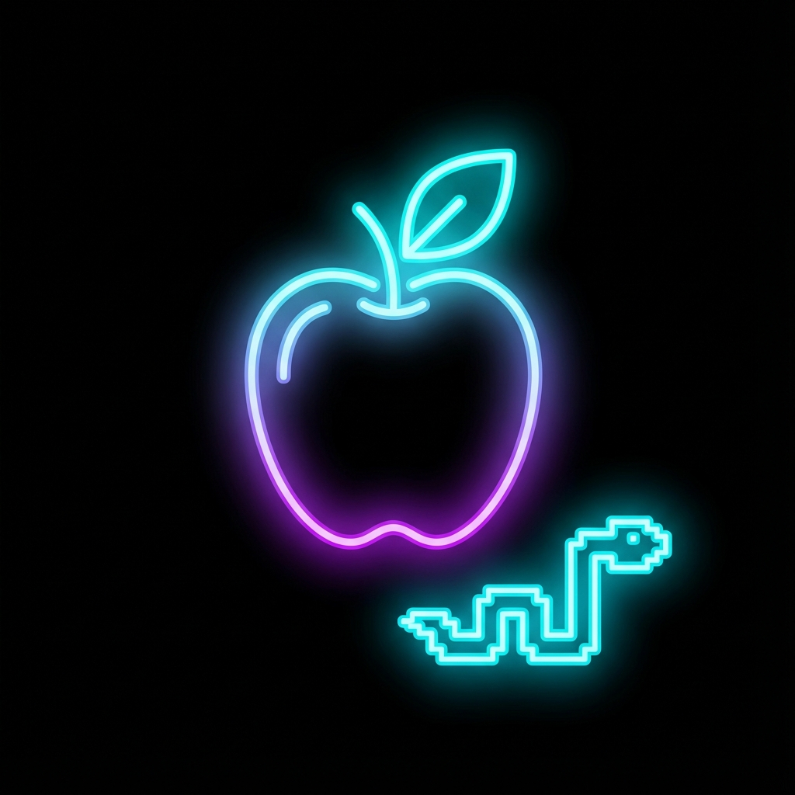

# Neon Snake.io 🐍✨

A modern, high-performance, multiplayer-style Snake game built with Vanilla JavaScript. Featuring a stunning neon aesthetic, spatial optimizations for massive entity counts, and smooth gameplay on both desktop and mobile.

 
*(Note: Replace with a screenshot of the actual game)*

## 🚀 Features

*   **Neon / Cyberpunk Aesthetic**: Glassmorphism UI, glowing neon cursors, and particle effects.
*   **High Performance**: Uses a **Spatial Hash Grid** for O(N) collision detection, supporting 1000+ food items and 50+ bots at 60FPS.
*   **Mobile Responsive**: Full touch support with smart coordinate mapping – play on your phone!
*   **Delta Time Physics**: Consistent game speed across high refresh rate (144Hz) and standard (60Hz) monitors.
*   **Level System**: Gain XP, level up, and physically grow larger as you dominate the leaderboard.
*   **Multiple Game Modes**:
    *   **Infinity**: Classic IO gameplay.
    *   **Time Rush**: Get the highest score in 2 minutes.
    *   **Survival**: Don't die.
    *   **Speed Force**: High-speed action.

## 🕹️ Controls

*   **Desktop**: Move your mouse to steer. Click to **Boost** (costs score).
*   **Mobile**: Touch and drag to steer. Double-tap or hold (depending on logic) to boost.

## 🛠️ Tech Stack

*   **Frontend**: HTML5, CSS3 (Variables, Flexbox, Glassmorphism).
*   **Logic**: Vanilla JavaScript (ES6+).
*   **Rendering**: HTML5 Canvas API (2D Context).
*   **No Frameworks**: Pure code for maximum performance and learning.

## 📦 How to Run

1.  Clone the repository:
    ```bash
    git clone https://github.com/shakibalhasan-code/snake_game.git
    ```
2.  Open `index.html` in your web browser.
3.  Enjoy!

## 🔮 Future Roadmap

*   [ ] Multiplayer WebSocket integration.
*   [ ] Custom skins shop.
*   [ ] Power-ups (Magnet, Shield, x2 Score).

## 📄 License

MIT © [Shakib Al Hasan](https://github.com/shakibalhasan-code)
